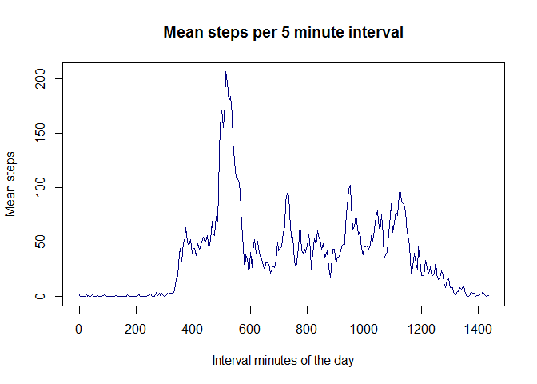
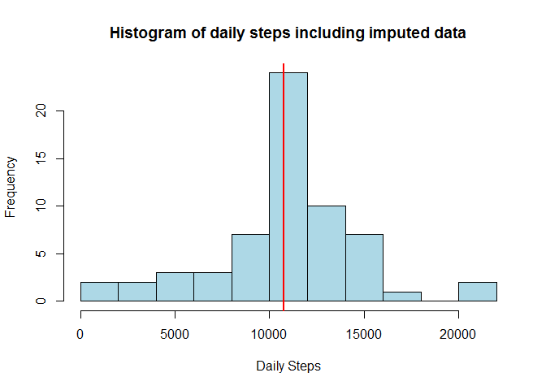

# Reproducible Research: Peer Assessment 1

The following analysis was carried out for assessment 1 of the Reproducible Research course. It looks at data from a single anonymous user's personal activity monitoring device collected during October and November 2012. The device captured the number of steps taken in 5 minute intervals each day.

## Loading and preprocessing the data

In this section, we load in the activity data and preprocess it ready for our analysis.


```r
# It is assumed the data exists in the working directory as "activity.zip".
# If you do not have the data, it can be downloaded from:
# https://d396qusza40orc.cloudfront.net/repdata%2Fdata%2Factivity.zip

# Unzip and then read in the data
unzip("activity.zip")
activity <- read.csv("activity.csv")
```

The interval variable within the data contains identifiers for the 5 minute interval in which the steps data were recorded. The identifier is also an indication of the time of day, resulting in both small (5 minute) and large (45 minute) gaps between numbers (e.g. 145, 150, 155, 200, 205, 210 etc.). Since parts of this analysis will be plotting intervals as time series, a new column is created which records the intervals at consistent 5 minute intervals (i.e. the number of minutes elapsed in the day). In addition, the interval variable is reformatted so that it is more readily interpreted as a time of day.


```r
# Extract the interval hour and minutes of the day
intervalHours <- activity$interval %/% 100
intervalMinutes <- activity$interval %% 100
# Create column with consistent intervals of 5 minutes for plotting
activity$minutesOfDay <- intervalHours * 60 + intervalMinutes
# Reformat the interval data to be more easily read as a time of the day
activity$interval <- paste(intervalHours, ":", intervalMinutes, sep = "")
activity$interval <- gsub(":0$", ":00", activity$interval)
activity$interval <- gsub(":5$", ":05", activity$interval)
```

The date variable gets loaded in as a factor, in order to be able to carry out date manipulations in our analysis, it is converted to a date object.


```r
# Convert date variable to date object
activity$date <- as.Date(activity$date)
```

## What is mean total number of steps taken per day?

To start our analysis, we will look at the number of steps taken each day.


```r
# Calculate the number of steps taken each day
dailySteps <- aggregate(steps ~ date, activity, sum)
```

Below is a histogram showing the total number of steps taken each day. The red line indicates the median number of daily steps.


```r
hist(dailySteps$steps, breaks = 12, main = "Histogram of daily steps",
     xlab = "Daily Steps", col = "light blue")
abline(v = median(dailySteps$steps), col = "red", lwd = 2)
```

<!-- -->


```r
# Calculate mean and median daily steps
mean(dailySteps$steps)
```

```
## [1] 10766.19
```

```r
median(dailySteps$steps)
```

```
## [1] 10765
```

We see that the mean total steps per day is 10766 (rounded to the nearest integer). While the median is 10765.

## What is the average daily activity pattern?

Now we want to look at the pattern of steps taken thoughout the day.


```r
# Calculate the mean number of steps taken during each interval
intervalSteps <- aggregate(steps ~ interval + minutesOfDay, activity, mean)
# Rename the steps column for ease of use in the "ImputeData" section
colnames(intervalSteps) <- c(colnames(intervalSteps[1:2]), "meanSteps")
```

Below is a time series plot showing the average steps behaviour across all intervals throughout the day.


```r
with(intervalSteps, plot(minutesOfDay, meanSteps, type = "l", col = "navy blue",
                         main = "Mean steps per 5 minute interval",
                         xlab = "Interval minutes of the day", ylab = "Mean steps"))
```

<!-- -->


```r
# Which interval has the maximum number of steps on average?
intervalSteps[intervalSteps$meanSteps == max(intervalSteps$meanSteps), ]
```

```
##     interval minutesOfDay meanSteps
## 104     8:35          515  206.1698
```

We can see that across all days, on average, the interval 8:35 (labelled "835" in the original data) has the maximum number of steps taken (206 steps).

## Imputing missing values


```r
# How many rows have missing values?
sum(is.na(activity$steps))
```

```
## [1] 2304
```

```r
# What proportion of all rows is this?
sum(is.na(activity$steps)) / nrow(activity)
```

```
## [1] 0.1311475
```

So far in this analysis, we have ignored the presence of missing values. However, there are 2304 rows with missing values (13% of all rows).  

We will now fill in those missing values by using the average number of steps across all days for the 5 minute interval in question.


```r
# Create the new data set by merging activity with the mean number of steps per interval
newActivity <- merge(activity, intervalSteps[, c("interval", "meanSteps")])
# Where the data set has missing values, fill these in with the mean number of steps for that interval
newActivity$steps <- ifelse(is.na(newActivity$steps), newActivity$meanSteps,
                            newActivity$steps)
```

With this new data set that includes imputed data, let's again look at the mean steps per day.


```r
# Calculate the number of steps taken each day
newDailySteps <- aggregate(steps ~ date, newActivity, sum)
```

Below is a histogram showing the total number of steps taken each day for the new data set. Again, the red line indicates the median number of daily steps.


```r
# Plot the histogram
hist(newDailySteps$steps, breaks = 12, col = "light blue",
     main = "Histogram of daily steps including imputed data",
     xlab = "Daily Steps")
abline(v = median(newDailySteps$steps), col = "red", lwd = 2)
```

<!-- -->


```r
# Calculate mean and median daily steps
mean(newDailySteps$steps)
```

```
## [1] 10766.19
```

```r
median(newDailySteps$steps)
```

```
## [1] 10766.19
```

The mean and median total steps per day are now both the same at 10766 (rounded to the nearest integer). This is very nearly the same as the estimates from earlier in this analysis (mean = 10766, median = 10765). From this and comparing the two histograms, we see that imputing missing data does not have a highly noticeable impact on the estimates of the total daily number of steps.

## Are there differences in activity patterns between weekdays and weekends?

Using our data set with imputed values, let's now look at whether there is a difference in the pattern of steps taken throughout the day on weekdays and weekends.


```r
# Create new variable indicating if the date is on a weekend or weekday
newActivity$typeOfDay <- as.factor(ifelse(weekdays(newActivity$date) %in% 
                                              c("Saturday", "Sunday"), 
                                          "weekend", "weekday"))
# Create table of average steps per interval by type of day
stepsByDayType <- aggregate(steps ~ interval + minutesOfDay + typeOfDay,
                            newActivity, mean)
```

Below are time series showing the average step pattern throughout the day on weekends and weekdays.


```r
# Load the ggplot2 package
library(ggplot2)
# Plot steps per interval by type of day
print(ggplot(stepsByDayType, aes(x = minutesOfDay, y = steps))
      + geom_line(color = "navy blue")
      + facet_grid(typeOfDay ~ .)
      + labs(title = "Comparing steps taken throughout the day on weekends and weekdays",
             x = "Interval minutes of the day", y = "Mean number of steps")
      + theme_bw())
```

<!-- -->

